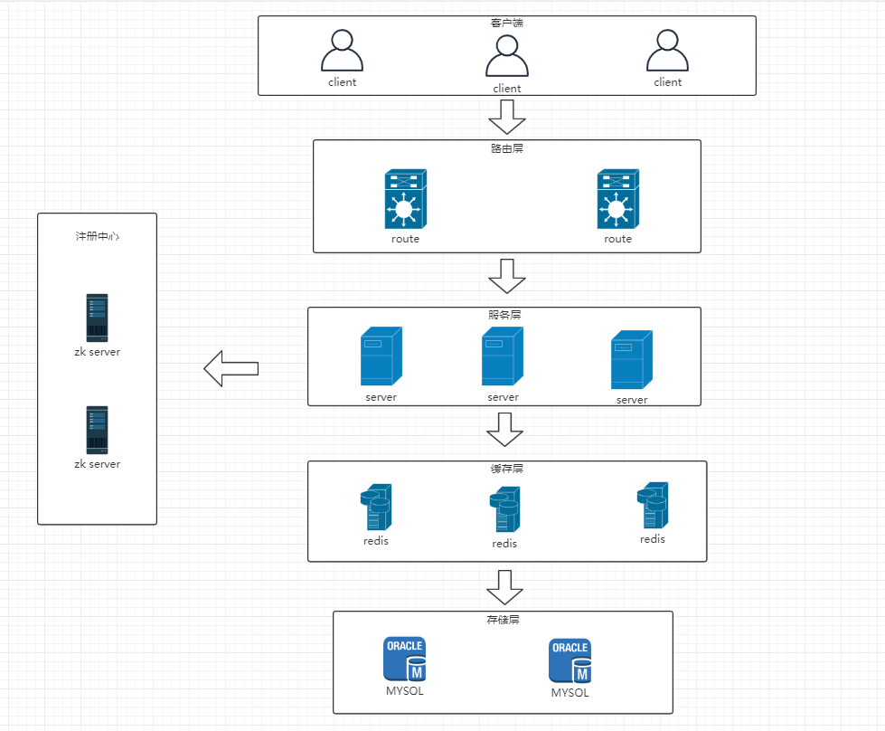

# myim
分布式即时通讯

## 项目介绍

采用了springboot、netty、zookeeper、redis、mysql等相关技术。
搭建一套支持分布式集群的即时通讯系统。

## 架构

## 模块介绍
* myim-common 公共功能模块，目前集成传输协议、zk、redis工具类等
* myim-server 通讯的服务模块，负责对通讯消息的接受、发送
* myim-route 路由模块，负责对客户端的连接信息路由和消息发送
* myim-client 客户端模块，发送和接受消息
* myim-multi-server 服务端多媒体模块，和myim-server的区别是myim-server只进行消息的接受和发送，myim-multi-server负责客户端发送文件、图片等进行处理和存储

## 时序图

## 功能

### done
* 通过控制台命令发送
* 不同用户单聊发送文本
 

### todo
* 支持发送图片、视频、文件等
* 群聊
* 开发客户端UI
* 客户端注册登录
* 服务端水平伸缩(服务器宕机使长连接转移)
* 数据存储(文本、文件、图片等)

### 演示